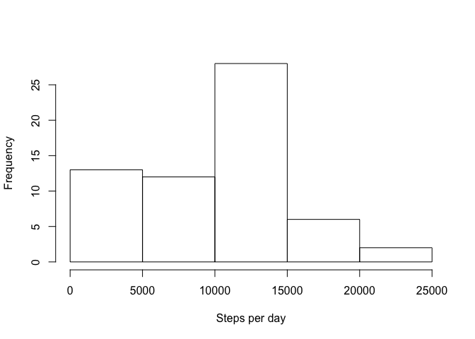
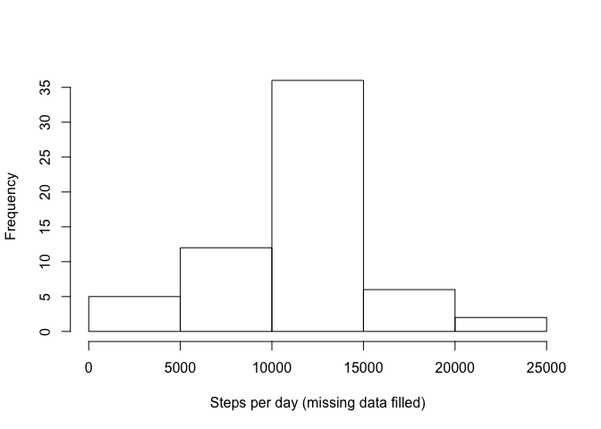
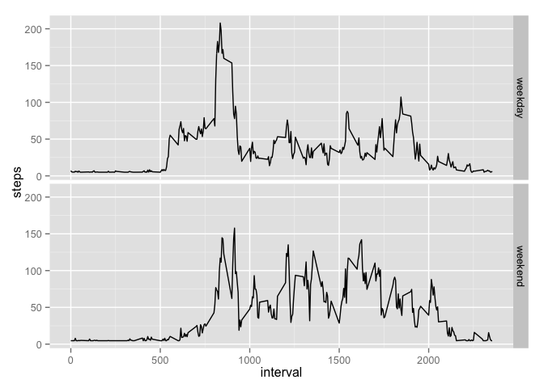

# Reproducible Research: Peer Assessment 1


## Loading and preprocessing the data


```r
knitr::opts_chunk$set(echo = TRUE)
```

Here is the structure of data:

```r
unzip(zipfile = "activity.zip")
data <- read.csv("activity.csv")
str(data)
```

```
## 'data.frame':	17568 obs. of  3 variables:
##  $ steps   : int  NA NA NA NA NA NA NA NA NA NA ...
##  $ date    : Factor w/ 61 levels "2012-10-01","2012-10-02",..: 1 1 1 1 1 1 1 1 1 1 ...
##  $ interval: int  0 5 10 15 20 25 30 35 40 45 ...
```


## What is mean total number of steps taken per day?

Here are the histogram of steps taken per day:

```r
stepsperday <- aggregate(data$steps, by = list(data$date), FUN = sum, na.rm = T)
names(stepsperday) <- c("date", "steps")
hist(stepsperday$steps, main = "",xlab = "Steps per day")
```

 

```r
meanvalue <- format(mean(stepsperday$steps, na.rm = T), digits = 5)
median <- format(median(stepsperday$steps, na.rm = T), digits = 5)
```

The mean of total number of steps taken per day is 9354.2 and the median is 10395.


## What is the average daily activity pattern?


```r
averagestepsperinterval <- aggregate(data$steps, by = list(data$interval), FUN = mean, na.rm = T)
names(averagestepsperinterval) <- c("interval", "steps")
with(averagestepsperinterval, plot(interval, steps, type = "l"))
```

 

```r
maximuminterval <- averagestepsperinterval[which.max(averagestepsperinterval$steps), "interval"]
```

The interval 835 contains maximum number of steps.


## Imputing missing values

Here are the histogram of steps taken per day (missing data filled):

```r
datanew <- data
datanew[is.na(datanew$steps), "steps"] <- mean(data$steps, na.rm = T)
stepsperdaynew <- aggregate(datanew$steps, by = list(datanew$date), FUN = sum, na.rm = T)
names(stepsperdaynew) <- c("date", "steps")
hist(stepsperdaynew$steps, main = "",xlab = "Steps per day (missing data filled)")
```

 

```r
meanfilled <- format(mean(stepsperdaynew$steps, na.rm = T), digits = 5)
medianfilled <- format(median(stepsperdaynew$steps, na.rm = T), digits = 5)
```

The mean of total number of steps taken per day is 10766 and the median is 10766.

## Are there differences in activity patterns between weekdays and weekends?


```r
library(ggplot2)
datanew$day <- NA
datanew$day[weekdays(as.Date(datanew$date)) %in% c("Saturday", "Sunday")] <- "weekend"
datanew$day[is.na(datanew$day)] <- "weekday" 
stepsbyintervalandday <- aggregate(steps ~ interval + day, data = datanew, mean)
ggplot(stepsbyintervalandday, aes(interval, steps)) + geom_line() + facet_grid(day ~ .)
```

 
